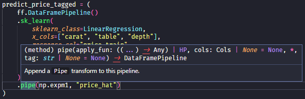

# 🧟 Frankenfit: it's alive! it's fit!

<p>
<a href="https://github.com/maxbane/frankenfit/actions/workflows/pytest.yml">
  </a>
<a href="https://github.com/maxbane/frankenfit/actions/workflows/docs.yml">
  </a>
<a href="https://github.com/maxbane/frankenfit/actions/workflows/mypy.yml">
  </a>
<a href="https://github.com/maxbane/frankenfit/blob/main/LICENSE.txt"></a>
<a href="https://github.com/psf/black"></a>
</p>

Frankenfit is a Python library for data scientists that provides a domain-specific
language (DSL) for creating, fitting, and applying predictive data modeling pipelines.
They key features are:

* A concise and readable DSL (inspired by the pandas [method-chaining style](https://tomaugspurger.github.io/posts/method-chaining/)) for creating data modeling **pipelines** from chains of composable building blocks called **transforms**. Pipelines themselves are composable, re-usable, and extensible, with a .
* Rigorous separation between fitting and applying. You can apply everything truly out-of-sample.
* Hyperparameter searches, cross-validation, and other resampling schemes.
* Parallel computation on distributed backends (currently Dask). Frankenfit
  automatically figures out what parts of your pipeline are independent of each other
  and runs them in parallel on a distributed compute cluster.
* A focus on user ergonomics and interactive usage. Extensive type annotations enable
  smart auto-completions by IDEs.
  [Visualizations](https://maxbane.github.io/frankenfit/current/transforms_and_pipelines.html#visualizing-pipelines)
  help you see what your pipelines are doing. You can [implement your own
  transforms](https://maxbane.github.io/frankenfit/current/implementing_transforms.html)
  with almost zero boilerplate.

Takes some inspiration from scikit-learn's [`pipeline`
module](https://scikit-learn.org/stable/modules/classes.html#module-sklearn.pipeline).
Integrates easily with third-party libraries like scikit-learn and statsmodels.

## Example

```python
# To be.
```

See the [Synopsis and
overview](https://maxbane.github.io/frankenfit/current/synopsis.html) section of the
documentation for a more extended example, and then dive into [Transforms and
pipelines](https://maxbane.github.io/frankenfit/current/transforms_and_pipelines.html)
to learn how it works from the ground up.

## Getting started

```
$ pip install frankenfit
```

If you want to use the [Dask](https://www.dask.org) backend for distributed computation
of your pipelines:
```
$ pip install "frankenfit[dask]"
```

The author of Frankenfit recommends importing it like this:
```python
import frankenfit as ff
```

Everything you need to get going is available in the public
[API](https://maxbane.github.io/frankenfit/current/api.html), `ff.*`. You might want to
start with a [synopsis](https://maxbane.github.io/frankenfit/current/synopsis.html) of
what you can do and proceed from there.

## Documentation

The most up-to-date documentation, corresponding to the unreleased `main` branch of this
repository, is available here: https://maxbane.github.io/frankenfit/current/.

The documentation provides a detailed narrative walkthrough of using the library for
predictive data modeling, as well as a complete API reference.  Please check it out!

## Type annotations

The entire Frankenfit library is meticulously type-annotated and checked with
[`mypy`](https://mypy.readthedocs.io), making use of Generic classes where it is
sensible to do so. Aside from catching logical errors, the main benefit of this to users
is that modern IDEs like [Visual Studio Code](https://code.visualstudio.com/) can
interpret the annotations statically to report the types of expressions and provide
intelligent auto-completions.



Frankenfit includes its own [mypy plugin](src/frankenfit/mypy.py). It is highly
recommended to enable it if you are using mypy to type-check your own code, which uses
Frankenfit. Just include the following in your project's `pyproject.toml`:

```toml
[tool.mypy]
plugins = "frankenfit.mypy"
```

## Development

If you're *not* hacking on the Frankenfit codebase itself, and just want to build or
install it from source, `$ pip build .`, `$ pip sdist .`, `$ pip install .` should all
work out of the box without creating any special virtual environment, as long as you're
using Python 3.8+ and a recent version of `pip`.

To get started with hacking on Frankenfit itself, make sure that the `python3.10`
binary is on your path, clone this repo, and run:

```
# this just creates a venv and does `pip install -e ".[dev]"`
$ ./setup-venv-dev python3.10
$ source ./.venv-dev/bin/activate
```

From there you may run tests with `$ tox -e py`, `$ tox mypy`, and so on.

The setup script automatically installs git pre-commit hooks. When you run `$ git
commit`, a few linters will run, possibly modifying the source. If files are modified by
the linters, it is necessary to `$ git add` them to staging again and re-run `$ git
commit`.

### Tests

We use the [`pytest`](pytest.org) testing framework together with the [`tox`](tox.wiki)
(v3) test runner. Tests live under `tests/` and are discovered by `pytest` according to
its normal discovery rules. Please be diligent about writing or updating tests for any
new or changed functionality. We use GitHub Actions to run tests on every pull request
and push to `main`.

### Code style and linters

We follow [`black`](https://github.com/psf/black) to the letter for code formatting and
additionally target [`flake8`](https://flake8.pycqa.org/) compliance, minus a few
exceptions documented in `pyproject.toml`. This is enforced at commit-time by
[`pre-commit`](pre-commit.com) hooks, and checked by post-push continuous integration.

### Dependencies and where they are defined

There are three categories of dependencies for the project:

* Run-time dependencies. These are the dependencies required of users to actually import
  and use the library. They are defined in `pyproject.toml` and will be installed
  automatically by pip when installing the `frankenfit` package. The set of required
  dependencies is small: `attrs`, `pandas`, `pyarrow`, and `graphviz`.

  * When installing Frankenfit, users may specify the optional feature (a.k.a. "extra")
    `dask` (i.e., `"frankenfit[dask]"`) to install `dask-distributed`, enabling use of
    the [`DaskBackend`](https://maxbane.github.io/frankenfit/current/backends.html).
    This is not included by default.

* Test-time and type-checking dependencies. Running the test suite requires additional
  dependencies beyond the run-time dependencies. They are declared by the `tests` extra
  in `pyproject.toml`.  Note that the `tests` extra depends on the `dask` extra, so that
  we may test Dask-related functionality.

* Documentation dependencies. Building the documentation requires [Jupyter
  Book](https://jupyterbook.org) and other additional dependencies, as declared by the
  `docs` extra in `pyproject.toml`.

* Developer dependencies, as declared by the `dev` extra. These are packages that a developer hacking on Frankenfit
  needs to make full use of the repository, including `pre-commit` for running linters
  without actually making a commit, `jupyter` for interacting with example notebooks, as
  well as all of the run-time and test-time dependencies to allow for editor
  autocompletions and ad hoc testing. The developer dependencies are defined in
  `requirements-dev.txt`, and are automatically installed to the environment created by
  the `setup-venv-dev` script.

### Writing documentation

Documentation lives in `docs/`, and we use [Jupyter Book](https://jupyterbook.org) to
build it as a static HTML site. Documentation content is written in Markdown
(specifically MyST), but the Python docstrings, which are included in the API reference
section of the documentation, must still be in reStructuredText (albeit [NumPy
style](https://www.sphinx-doc.org/en/master/usage/extensions/napoleon.html)), so it's a
bit of a Frankenstein situation.
